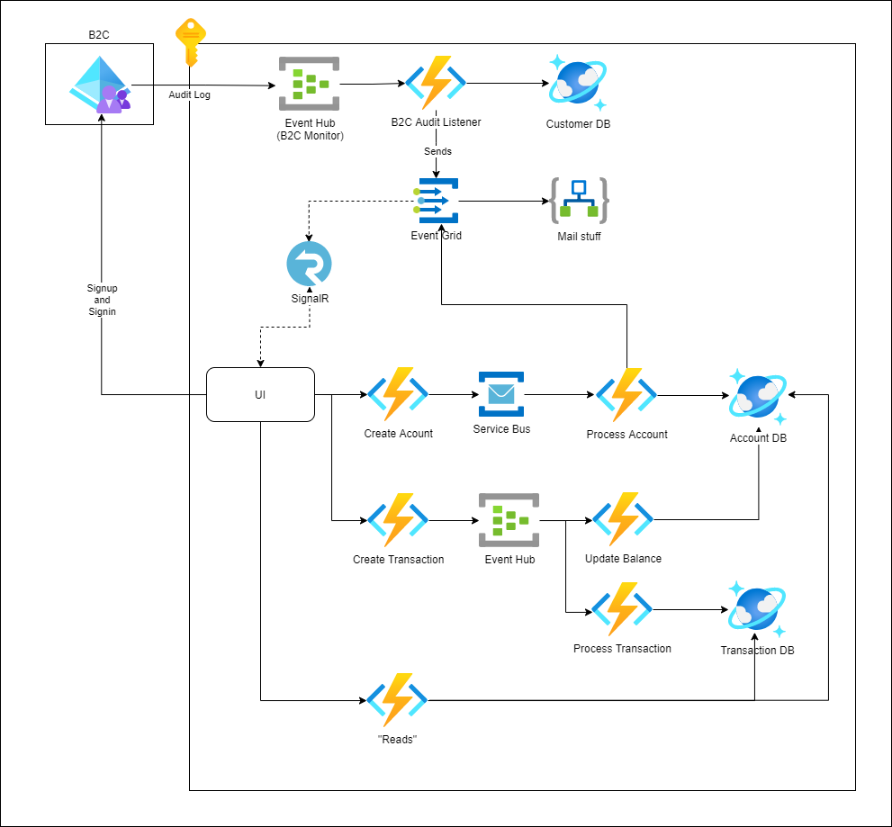

# event-based-sample-app


## Prerequisites
* Enable the Azure AD B2C Diagnostic settings to report to Event Hub https://docs.microsoft.com/en-us/azure/active-directory-b2c/azure-monitor
* Three B2C App registrations
  * B2C Service Principal
  * B2C UI
  * B2C API
## Terraform
List of environment variables to setup:
* ARM_CLIENT_ID
* ARM_CLIENT_SECRET
* ARM_TENANT_ID
* TF_VAR_container_name
* TF_VAR_resource_group_name
* TF_VAR_storage_account_name
* TF_VAR_subscription_id
* TF_VAR_key
* TF_VAR_email
* TF_VAR_api_issuer
* TF_VAR_api_client_id
* TF_VAR_api_client_secret

```
cd terraform
./env_setup.sh
terraform init --backend-config=backend.tfvars
terraform plan -out theplan
terraform apply -auto-approve theplan
```
## After Terraform
* Event Hub Connection String to keyvault

## Other Helpful Links
* https://github.com/Azure-Samples/ms-identity-javascript-react-tutorial
* https://stackoverflow.com/questions/57740782/message-bus-vs-service-bus-vs-event-hub-vs-event-grid