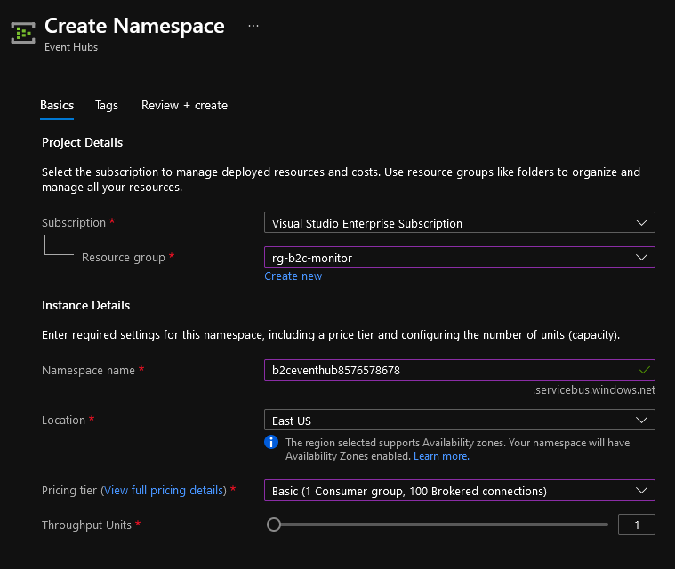

# event-based-sample-app

## Prerequisites
Please perform the steps in this document up to step: **5**
https://docs.microsoft.com/en-us/azure/active-directory-b2c/azure-monitor

## Event Hub

## After Terraform
After the Terraform has ran, please go back to https://docs.microsoft.com/en-us/azure/active-directory-b2c/azure-monitor and associate the terraform created event hub with your b2c diagnostic settings.